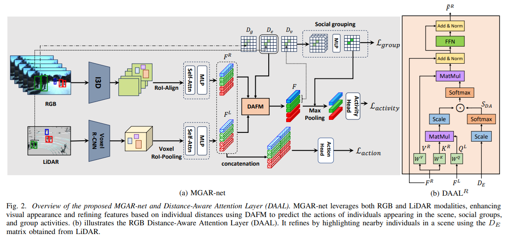
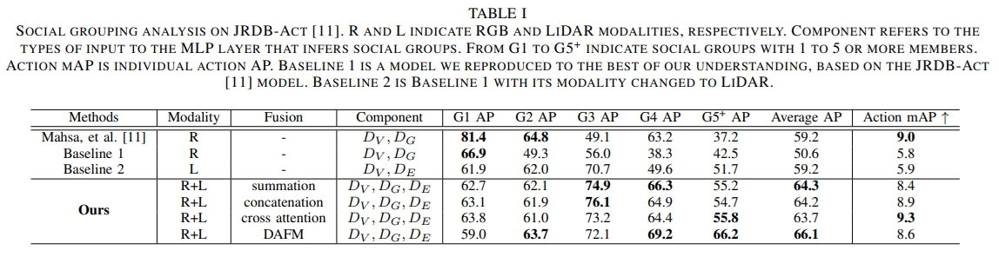

# [IEIE 2024] Mitigating Hallucinations in Vision Language Models with High-pass Filters

[paper](https://www.dbpia.co.kr/journal/articleDetail?nodeId=NODE11890949)

2024년도 대한전자공학회 하계학술종합대회

## Abstract

Recent advancements in large-scale natural language processing models have been successfully progressing, demonstrating outstanding performance across various tasks. Building on this progress, large vision-language models capable of processing both images and natural language simultaneously have been rapidly growing and gaining significant attention in the field of computer vision. However, a common issue with vision-language models is the hallucination phenomenon, where the model incorrectly identifies objects that do not appear in the image.

In this paper, we introduce a method to mitigate hallucination by leveraging high-pass filtering techniques to enhance the model’s understanding of images. High-pass filtering provides diverse perspectives on a single image, aiding the model in better comprehending visual information and reducing hallucination. The proposed approach does not require additional training for large vision-language models and is both simple and easily applicable to various models. Experimental results on the POPE benchmark, a standard evaluation framework for assessing hallucination, demonstrate the effectiveness of our method.


## Setup

```bash
conda create llm python=3.10
conda activate llm
git clone https://github.com/kdu3613/IEIE2024.git
cd neurips2024
pip install -r requirements.txt
```


## Models

* **LLaVA-1.5**
* **Instruct-BLIP**
* **Qwen-VL**


## Method


<p align="center" width="100%">

</p>


## Evaluation (TODO)

* **POPE (llava, qwen-vl)**: `bash eval_bench/scripts/pope_eval_batch.sh` 
  - Need to specify "model", "model_path"
* **POPE (instructblip)**: `bash experiments/cd_scripts/pope_eval.sh` 
  - Need to specify "model", "model_path"
* **CHAIR (llava, qwen-vl, instructblip)**: `bash eval_bench/scripts/chair_eval_batch.sh`
  - Need to specify "model", "model_path", "type"
* **LLaVA-Bench (llava)**: `bash eval_bench/scripts/llava_bench_eval.sh`
  - Need to specify "model", "model_path"
* **MME (llava, qwen-vl, instructblip)**: `bash experiments/cd_scripts/mme_eval.sh`
  - Need to specify "model", "model_path"
  
<p align="center" width="100%">

</p>

## Acknowledgments
This codebase borrows from most notably [VCD](https://github.com/DAMO-NLP-SG/VCD), [OPERA](https://github.com/shikiw/OPERA), and [LLaVA](https://github.com/haotian-liu/LLaVA).
Many thanks to the authors for generously sharing their codes!

-----

