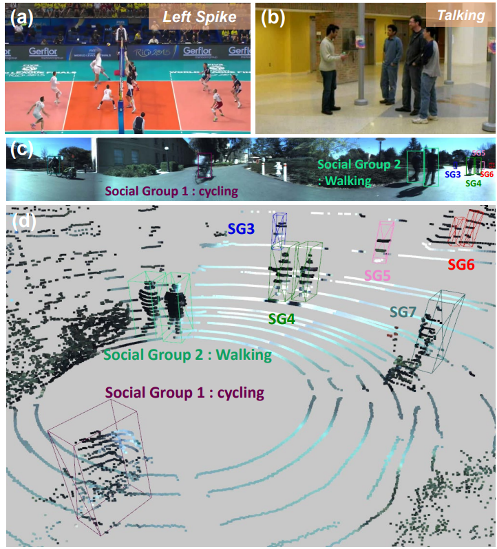

# [VCIP 2023] Multi-modal Social Group Activity Recognition in Panoramic Scene

[paper](https://ieeexplore.ieee.org/document/10402675)

2023 IEEE Visual Communications and Image Processing (*VCIP*).

<p align="center" width="50%">

</p>


## Abstract

Group Activity Recognition (GAR) is a challenging
problem in computer vision due to the intricate dynamics and
interactions among individuals. The existing methods utilize RGB
videos face challenges in panoramic environments with numerous
individuals and social groups. In this paper, we propose Multi-
modal Group Activity Recognition network (MGAR-net), that
leverages the combined power of RGB and LiDAR modalities.
Our approach effectively utilizes information from both modalities
thus robustly and accurately captures individual relationships and
detects social groups in face of optical challenges. By harnessing
the capability of LiDAR with our new fusion module, called
Distance Aware Fusion Module (DAFM), MGAR-net acquires
valuable 3D structure information. We conduct experiments on
the JRDB-Act dataset, which contains challenging scenarios with
numerous people. The results demonstrate that LiDAR data
provide valuable information for social grouping and recognizing
individual action and group activities, particularly in crowded
group settings. For social grouping, our MGAR-net improve
performance by about 12% compared to the existing state-of-the-
art models in terms of the AP metric.


## Setup

```bash
conda create MGAR python=3.10
conda activate MGAR
git clone https://github.com/kdu3613/Multimodal_GAR.git
cd Multimodal_GAR
pip install -r requirements.txt
```

## Usage

The model and training settings can be configured using the `Multimodal_cfg/mil3.yaml` file, and model training and evaluation can be performed using `train_func.py`.


## Method


<p align="center" width="100%">

</p>


## Evaluation

  
<p align="center" width="100%">

</p>

## Acknowledgments
This codebase was built based on [JRDB](https://github.com/JRDB-dataset/jrdb_toolkit) and [Mahsa et. al.](https://arxiv.org/abs/2007.02632).

Many thanks to the authors!

-----

